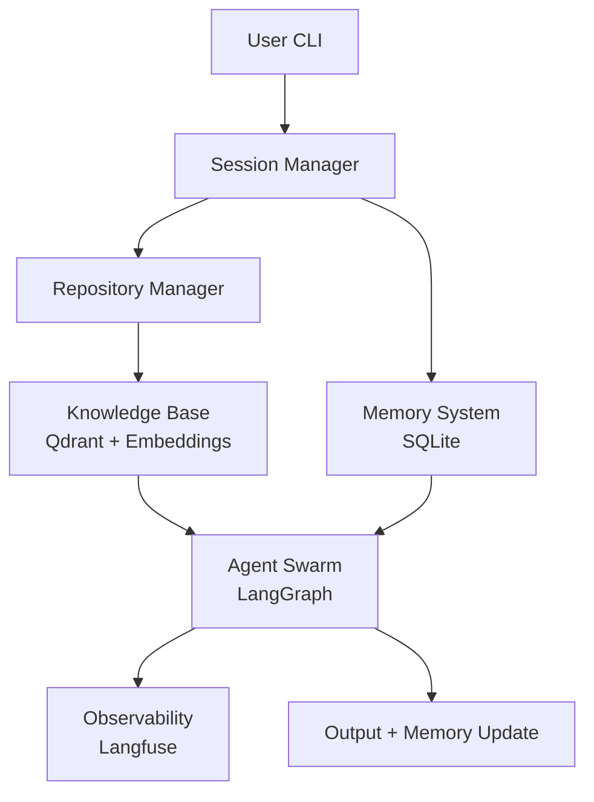

# CodeTurtle

> A local-first, multi-agent code review system that understands your entire repository and remembers previous reviews.

[](https://www.python.org/)
[](https://opensource.org/licenses/MIT)

CodeTurtle is an intelligent, local-first code review assistant powered by a multi-agent system. It combines a **repository knowledge base**, **persistent memory**, and a **specialized agent swarm** to deliver high-quality, context-aware code reviews — all running on your machine using Ollama.

---

## ✨ Key Features

- **Repository-Aware Analysis** — Builds a semantic knowledge base of your entire codebase using embeddings.
- **Multi-Agent Review Swarm** — Four specialized agents collaborate to analyze, critique, and recommend changes.
- **Session-Based Memory** — Remembers previous reviews within a session for consistent feedback.
- **Full Observability** — Integrated with Langfuse for tracing, latency analysis, and metadata tracking.
- **Local-First Architecture** — Runs completely offline using Ollama (no data leaves your machine).
- **Clean & Extensible CLI** — Built with modern Python tooling (Typer + Rich).

---

## 🏗 Architecture Overview

CodeTurtle follows a modular, layered architecture designed for extensibility and observability.

### High-Level Architecture



### Detailed Data Flow

1. **Session Initialization**
   - User starts a new session (`new-session`).
   - A unique `conversation_id` is generated and stored.

2. **Repository Ingestion**
   - User adds a repository using `add-repo owner/repo`.
   - Repository is cloned locally.
   - Source code and documentation are chunked, embedded (`nomic-embed-text`), and stored in **Qdrant**.

3. **Review Request**
   - User runs `review owner/repo PR_NUMBER`.
   - System loads the current session and relevant memory.
   - Relevant code chunks are retrieved from the knowledge base using semantic search.

4. **Context Summarization**
   - Raw retrieved context is passed through a **Context Summarizer** agent to reduce token usage and improve focus.

5. **Agent Swarm Execution**
   - The summarized context + PR diff + previous reviews are fed into a **4-agent LangGraph swarm**:
     - **Context Gatherer**
     - **Code Quality Reviewer**
     - **Critic**
     - **Final Recommender**

6. **Observability & Persistence**
   - Full trace (including latency, token usage, and metadata) is sent to **Langfuse**.
   - Review results are saved to the memory store (SQLite).

---

## 🧠 Agent Swarm Design

| Agent                    | Responsibility                              | Key Inputs                          | Output                     |
|--------------------------|---------------------------------------------|-------------------------------------|----------------------------|
| **Context Summarizer**   | Condenses retrieved codebase context        | Raw knowledge base chunks           | Concise technical summary  |
| **Context Gatherer**     | Understands PR intent + relevant context    | PR metadata + summarized context    | Focus areas for review     |
| **Code Quality Reviewer**| Performs detailed code analysis             | PR diff + summarized context        | Quality issues & suggestions |
| **Critic**               | Reviews previous agent outputs              | All prior outputs + memory          | Improved analysis          |
| **Final Recommender**    | Delivers final verdict + GitHub comment     | Complete analysis                   | Recommendation + comment   |

---

## 🚀 Getting Started

### Prerequisites

- Python 3.10+
- [Ollama](https://ollama.com/) installed and running
- Git

### Installation

```bash
git clone https://github.com/yourusername/codeturtle.git
cd codeturtle

# Using uv (recommended)
uv sync

# Or using pip
pip install -e .
```

### Environment Setup

Create a `.env` file in the root directory:

```env
GITHUB_TOKEN=ghp_your_token_here
OLLAMA_MODEL=qwen2.5:7b
OLLAMA_BASE_URL=http://localhost:11434

# Optional - Langfuse Observability
LANGFUSE_PUBLIC_KEY=pk-lf-xxxx
LANGFUSE_SECRET_KEY=sk-lf-xxxx
LANGFUSE_HOST=https://cloud.langfuse.com
```

### Basic Usage

```bash
# 1. Start a new session
python -m cli.main new-session

# 2. Add a repository
python -m cli.main add-repo embeddings-benchmark/mteb

# 3. Review a Pull Request
python -m cli.main review embeddings-benchmark/mteb 4913 --dry-run
```

---

## 📚 Available Commands

| Command                  | Description                                      |
|--------------------------|--------------------------------------------------|
| `new-session`            | Start a new working session                      |
| `list-sessions`          | List all previous sessions                       |
| `add-repo owner/repo`    | Clone repo and build vector knowledge base       |
| `review owner/repo #`    | Review a Pull Request with full agent swarm      |
| `review ... --verbose`   | Run with detailed error output                   |

---

## 🔍 Observability

CodeTurtle integrates deeply with **[Langfuse](https://langfuse.com)** for production-grade observability:

- Full trace of every agent execution
- Token usage and latency per agent
- Custom metadata (`repo`, `pr_number`, `session_id`)
- Session grouping for easier analysis

Traces can be viewed at [cloud.langfuse.com](https://cloud.langfuse.com) (or your self-hosted instance).

---

## 🗺 Development Roadmap

- [ ] Further latency optimization (target: < 2 minutes)
- [ ] Structured output from agents using Pydantic
- [ ] Parallel agent execution
- [ ] Support for reviewing Issues + PR ↔ Issue linking
- [ ] Packaging as `pip install codeturtle`
- [ ] Evaluation framework for review quality
- [ ] Self-hosted deployment options

---

## 🤝 Contributing

We welcome contributions! Please see [CONTRIBUTING.md](CONTRIBUTING.md) for guidelines.

---

## 📄 License

This project is licensed under the **MIT License** — see the [LICENSE](LICENSE) file for details.

---

## 🙏 Acknowledgements

- [LangGraph](https://langchain-ai.github.io/langgraph/) — Agent orchestration
- [Ollama](https://ollama.com/) — Local LLM inference
- [Langfuse](https://langfuse.com/) — LLM observability
- [Qdrant](https://qdrant.tech/) — Vector database

---

> **Note**: CodeTurtle is under active development. Core functionality is stable, but APIs and CLI may evolve.
```

---

### How to Use This README

1. Create a file named `README.md` in your project root.
2. Replace `yourusername` with your actual GitHub username.
3. (Optional) Add a logo or banner at the top if you create one later.
4. Update the **Roadmap** section as you complete features.

Would you also like me to create a **`CONTRIBUTING.md`** and **`LICENSE`** file to go along with this professional README?