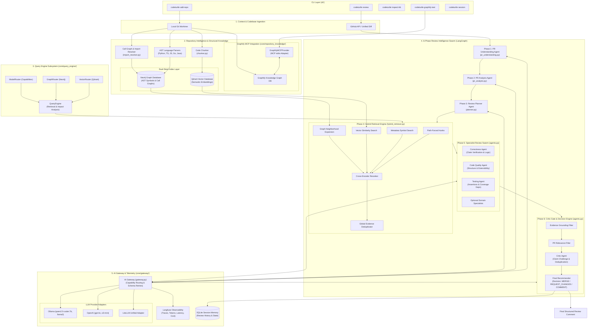
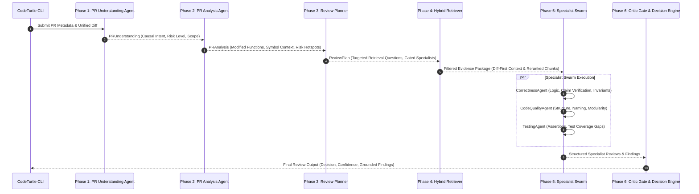

# CodeTurtle

> **Autonomous, Local-First Multi-Agent Swarm for Repository-Aware GitHub Code Reviews**

[](https://www.python.org/downloads/)
[](https://github.com/langchain-ai/langgraph)
[](https://modelcontextprotocol.io/)
[](https://qdrant.tech/)
[](https://neo4j.com/)
[](https://ollama.ai/)
[](https://langfuse.com/)

CodeTurtle is an **AI-native, repository-intelligent code review platform**. Unlike traditional LLM review tools that operate strictly on isolated diff snippets, CodeTurtle constructs a deep, structural understanding of your entire repository using hybrid vector-graph RAG, Graphify MCP integration, hypothesis-driven review planning, and a multi-agent swarm to evaluate pull requests against real system invariants.

---

## Key Capabilities & Highlights

- **Repository-Aware Hybrid RAG**: Dual-store vector (`Qdrant`) + graph (`Neo4j`) indexing captures semantic embeddings, AST symbol definitions, import dependencies, and caller/callee graphs.
- **Graphify MCP Server Integration**: Native integration with Graphify via Model Context Protocol (MCP stdio connection), exposing graph queries, symbol lookup, neighborhood exploration, and shortest path traversals.
- **Hypothesis-Driven Review Planning**: Formulates targeted retrieval questions based on PR changes, allocating plan-gated specialist agents according to risk profiles and modified symbol boundaries.
- **Diff-First Context Packing & Deduplication**: Leads with the unified diff as primary ground truth, applying path-forced diff hunks, cross-encoder structural reranking, and global evidence deduplication (`merge_evidence_packages`).
- **Claim-Challenging Multi-Agent Swarm**: Autonomous domain specialists (`CorrectnessAgent`, `CodeQualityAgent`, `TestingAgent`) bound by anti-summarization contracts that actively challenge core claims in pull requests instead of providing generic findings.
- **Critic Gate & Reasoned Decision Engine**: Filters ungrounded or off-target findings, resolves specialist contradictions, and generates actionable, structured final review recommendations (`MERGE`, `REQUEST_CHANGES`, `COMMENT`).
- **Decoupled Query Engine**: Subsystem with dedicated routers (`VectorRouter`, `GraphRouter`, `ModelRouter`) supporting contextual retrieval and automated impact analysis.
- **Local-First AI Gateway**: Capability-based provider gateway supporting local models via Ollama (`qwen2.5-coder:7b`, `llama3`), OpenAI (`gpt-4o`, `o3-mini`), and LiteLLM endpoints with automatic schema retries and Langfuse telemetry.
- **Phase-by-Phase Benchmark Suite**: Built-in evaluation harness (`evals/ri/`) for continuous quantitative benchmark testing across all 6 review pipeline phases.

---

## System Architecture

The following diagram illustrates CodeTurtle's end-to-end architecture across CLI commands, codebase ingestion, repository intelligence & Graphify MCP adapter, query engine, 6-phase review swarm, and AI gateway infrastructure:


```mermaid
flowchart TB
    subgraph CLI ["CLI Layer (cli/)"]
        direction LR
        CmdReview["codeturtle review"]
        CmdAddRepo["codeturtle add-repo"]
        CmdInspect["codeturtle inspect-kb"]
        CmdGraphify["codeturtle graphify-test"]
        CmdSession["codeturtle session"]
    end

    subgraph Ingestion ["1. Context & Codebase Ingestion"]
        direction LR
        GitHubAPI["GitHub API / Unified Diff"]
        LocalRepo["Local Git Worktree"]
    end

    subgraph KnowledgeLayer ["2. Repository Intelligence & Structural Knowledge"]
        direction TB
        ASTParser["AST Language Parsers<br/>(Python, TS, JS, Go, Java)"]
        GraphBuilder["Call Graph & Import Resolver<br/>(import_resolver.py)"]
        Chunker["Code Chunker<br/>(chunker.py)"]
        
        subgraph GraphifyMCP ["Graphify MCP Integration (core/repository_knowledge/)"]
            MCPAdapter["GraphifyMCPProvider<br/>(MCP stdio Adapter)"]
            GraphifyEngine["Graphify Knowledge Graph DB"]
            MCPAdapter <--> GraphifyEngine
        end

        subgraph Databases ["Dual-Store Index Layer"]
            Qdrant[("Qdrant Vector Database<br/>(Semantic Embeddings)")]
            Neo4j[("Neo4j Graph Database<br/>(AST Symbols & Call Graphs)")]
        end

        LocalRepo --> ASTParser & GraphBuilder & Chunker & GraphifyEngine
        Chunker --> Qdrant
        ASTParser & GraphBuilder --> Neo4j
    end

    subgraph QuerySubsystem ["3. Query Engine Subsystem (core/query_engine/)"]
        VectorRouter["VectorRouter (Qdrant)"]
        GraphRouter["GraphRouter (Neo4j)"]
        ModelRouter["ModelRouter (Capabilities)"]
        QueryEngine["QueryEngine<br/>(Retrieval & Impact Analysis)"]
        
        VectorRouter & GraphRouter & ModelRouter --> QueryEngine
    end

    subgraph Pipeline ["4. 6-Phase Review Intelligence Swarm (LangGraph)"]
        direction TB
        
        P1["Phase 1: PR Understanding Agent<br/>(pr_understanding.py)"]
        P2["Phase 2: PR Analysis Agent<br/>(pr_analysis.py)"]
        P3["Phase 3: Review Planner Agent<br/>(planner.py)"]
        
        subgraph P4Sub ["Phase 4: Hybrid Retrieval Engine (hybrid_retriever.py)"]
            PathForce["Path-Forced Hunks"]
            SymbolSearch["Metadata Symbol Search"]
            VectorSearch["Vector Similarity Search"]
            GraphExp["Graph Neighborhood Expansion"]
            Reranker["Cross-Encoder Reranker"]
            GlobalDedupe["Global Evidence Deduplicator"]

            PathForce & SymbolSearch & VectorSearch & GraphExp --> Reranker --> GlobalDedupe
        end

        subgraph P5Sub ["Phase 5: Specialist Review Swarm (agents.py)"]
            Correctness["Correctness Agent<br/>(Claim Verification & Logic)"]
            CodeQuality["Code Quality Agent<br/>(Structure & Extensibility)"]
            Testing["Testing Agent<br/>(Assertions & Coverage Gaps)"]
            OptionalAgents["Optional Domain Specialists"]
        end

        subgraph P6Sub ["Phase 6: Critic Gate & Decision Engine (agents.py)"]
            GroundingFilter["Evidence Grounding Filter"]
            RelevanceFilter["PR Relevance Filter"]
            CriticGate["Critic Agent<br/>(Claim Challenge & Deduplication)"]
            FinalRecommender["Final Recommender<br/>(Decision: MERGE / REQUEST_CHANGES / COMMENT)"]

            GroundingFilter --> RelevanceFilter --> CriticGate --> FinalRecommender
        end

        P1 --> P2 --> P3 --> P4Sub --> P5Sub --> P6Sub
    end

    subgraph Infra ["5. AI Gateway & Telemetry (core/gateway/)"]
        direction TB
        Gateway["AI Gateway (gateway.py)<br/>(Capability Routing & Schema Retries)"]
        
        subgraph LLMProviders ["LLM Provider Adapters"]
            Ollama["Ollama (qwen2.5-coder:7b, llama3)"]
            OpenAI["OpenAI (gpt-4o, o3-mini)"]
            LiteLLM["LiteLLM Unified Adapter"]
        end

        Langfuse["Langfuse Observability<br/>(Traces, Tokens, Latency, Cost)"]
        Memory[("SQLite Session Memory<br/>(Review History & State)")]

        Gateway --> Ollama & OpenAI & LiteLLM
        Gateway --> Langfuse
    end

    GitHubAPI --> P1
    CmdAddRepo --> LocalRepo
    CmdReview --> GitHubAPI
    CmdGraphify --> MCPAdapter
    
    Qdrant --> VectorSearch
    Neo4j --> GraphExp
    QueryEngine --> P4Sub
    
    P1 <--> Gateway
    P2 <--> Gateway
    P3 <--> Gateway
    P5Sub <--> Gateway
    P6Sub <--> Gateway

    FinalRecommender --> ReviewOutput["Final Structured Review Comment"]
    FinalRecommender --> Memory
```

---

## The 6-Phase Review Pipeline

CodeTurtle executes PR reviews via a deterministic, multi-stage LangGraph workflow:


```mermaid
sequenceDiagram
    autonumber
    participant CLI as CodeTurtle CLI
    participant P1 as Phase 1: PR Understanding Agent
    participant P2 as Phase 2: PR Analysis Agent
    participant P3 as Phase 3: Review Planner
    participant P4 as Phase 4: Hybrid Retriever
    participant P5 as Phase 5: Specialist Swarm
    participant P6 as Phase 6: Critic Gate & Decision Engine

    CLI->>P1: Submit PR Metadata & Unified Diff
    P1-->>P2: PRUnderstanding (Causal Intent, Risk Level, Scope)
    P2-->>P3: PRAnalysis (Modified Functions, Symbol Context, Risk Hotspots)
    P3-->>P4: ReviewPlan (Targeted Retrieval Questions, Gated Specialists)
    P4-->>P5: Filtered Evidence Package (Diff-First Context & Reranked Chunks)

    par Specialist Swarm Execution
        P5->>P5: CorrectnessAgent (Logic, Claim Verification, Invariants)
        P5->>P5: CodeQualityAgent (Structure, Naming, Modularity)
        P5->>P5: TestingAgent (Assertions, Test Coverage Gaps)
    end

    P5-->>P6: Structured Specialist Reviews & Findings
    P6-->>CLI: Final Review Output (Decision, Confidence, Grounded Findings)
```

### Phase Details

1. **Phase 1: PR Understanding (`pr_understanding.py`)**
   - Extracts causal intent (what broke → why → how the fix addresses it), risk level (`low`, `medium`, `high`, `critical`), and explicit out-of-scope boundaries from the PR title and description.
2. **Phase 2: PR Analysis (`pr_analysis.py`)**
   - Deterministically parses diff hunks to identify modified functions, added functions, constants, test changes, and modified files. Scans surrounding context to recover enclosing symbols.
3. **Phase 3: Review Planning (`planner.py`)**
   - Formulates targeted retrieval questions and allocates plan-gated specialist agents (`CORRECTNESS`, `CODE_QUALITY`, `TESTING`, `SECURITY`, `PERFORMANCE`, etc.) based on risk hotspots and file touch points.
4. **Phase 4: Hybrid Retrieval & Evidence Deduplication (`hybrid_retriever.py`)**
   - Combines path-forced diff hunks, metadata symbol lookup, vector similarity search, and graph neighbor expansion. Uses cross-encoder structural reranking (`reranker.py`) and global deduplication (`merge_evidence_packages`).
5. **Phase 5: Specialist Swarm Execution (`agents.py`)**
   - Dispatches plan-gated domain specialists with **diff-first context packing** (unified diff leads prompt, evidence is secondary). Specialists actively challenge PR claims under anti-summarization prompt contracts.
6. **Phase 6: Critic Gate & Decision Engine (`agents.py`)**
   - Applies evidence grounding and relevance filters, deduplicates overlapping findings, resolves specialist contradictions, and computes the final recommendation: `MERGE`, `REQUEST_CHANGES`, or `COMMENT`.

---

## Graphify MCP & Repository Knowledge Layer

CodeTurtle introduces an extensible structural knowledge abstraction boundary (`core/repository_knowledge/`):

- **`RepositoryKnowledgeProvider`**: Abstract interface decoupling code review agents from underlying graph engines.
- **`GraphifyMCPProvider`**: Model Context Protocol (MCP) adapter connecting directly to Graphify knowledge graphs via stdio transport (`mcp` SDK).
- **Exposed MCP Tools**:
  - `query_graph`: Natural language graph queries over code relations.
  - `get_node`: Direct symbol/file node inspection.
  - `get_neighbors`: 1-hop caller/callee and import neighborhood retrieval.
  - `shortest_path`: Dependency and call-chain pathfinding between two code symbols.
  - `graph_stats`: Summary metrics of repository graph nodes and edges.

---

## Query Engine Subsystem

CodeTurtle features a decoupled **Query Engine** (`core/query_engine/`) for structured codebase exploration:

- **`VectorRouter`**: Semantic similarity search against Qdrant collection embeddings.
- **`GraphRouter`**: Cypher structural queries against Neo4j AST and import graph edges.
- **`ModelRouter`**: Capability-based LLM routing for context synthesis.
- **`QueryEngine`**: Orchestrates multi-router query execution, supporting `retrieve_context` and automated `impact_analysis`.

---

## AI Gateway & Telemetry

All LLM requests route through a unified **AI Gateway** (`core/gateway/gateway.py`):

- **Capability-Based Routing**: Maps agent roles (`reasoning`, `correctness_review`, `code_quality_review`, `summarization`) to configured model providers.
- **Provider Support**: Seamlessly switches between local Ollama instances (`qwen2.5-coder:7b`, `llama3`), OpenAI (`gpt-4o`, `o3-mini`), or LiteLLM endpoints.
- **Structured JSON Retries**: Pydantic schema enforcement with automatic retry handling.
- **Langfuse Telemetry**: Tracks per-agent prompt/completion tokens, latency, retries, cost estimates, and full execution traces.

---

## Repository Structure

```
CodeTurtle/
├── cli/                        # Typer CLI application
│   ├── commands/               # CLI command modules
│   │   ├── add_repo.py         # Index repository into KnowledgeBase
│   │   ├── graphify_cmd.py     # Graphify MCP integration CLI (`graphify-test`)
│   │   ├── init.py             # Initialize configuration & environment
│   │   ├── inspect_kb.py       # Inspect vector & graph stores
│   │   ├── review.py           # Execute 6-phase review pipeline
│   │   └── session.py          # Manage review sessions & memory
│   └── main.py                 # CLI entry point (`codeturtle`)
│
├── core/                       # Core engine & agent logic
│   ├── gateway/                # AI Gateway & provider integrations
│   │   ├── gateway.py          # AIGateway routing & telemetry
│   │   └── providers.py        # Ollama, OpenAI, LiteLLM adapters
│   │
│   ├── query_engine/           # Decoupled Query Engine subsystem
│   │   ├── routers/            # Vector, Graph, and Model query routers
│   │   │   ├── graph_router.py # Neo4j Cypher structural queries
│   │   │   ├── model_router.py # Capability model routing
│   │   │   └── vector_router.py# Qdrant semantic vector queries
│   │   ├── engine.py           # Unified retrieval & impact analysis engine
│   │   └── types.py            # Query Engine types & schemas
│   │
│   ├── repository_intelligence/# Codebase parsing & graph indexing
│   │   ├── graph/              # Neo4j query builders & import resolvers
│   │   ├── parsers/            # Language AST parsers (Python, TS, JS, Go, Java)
│   │   └── pipeline.py         # Repository indexing pipeline
│   │
│   ├── repository_knowledge/   # Graphify MCP & Repository Knowledge Boundary
│   │   ├── factory.py          # Provider factory (get_knowledge_provider)
│   │   ├── graphify_mcp.py     # Graphify MCP stdio adapter (Model Context Protocol)
│   │   ├── models.py           # Structural Node, Edge, Query response schemas
│   │   ├── paths.py            # Repository graph path resolvers
│   │   └── provider.py         # RepositoryKnowledgeProvider abstract interface
│   │
│   ├── review_intelligence/    # Planner & evidence utilities
│   │   ├── evidence_util.py    # Evidence package normalization
│   │   ├── models.py           # ReviewPlan & RetrievalQuestion schemas
│   │   └── planner.py          # Phase 3 Review Planner Agent
│   │
│   ├── agents.py               # Phase 5 Specialists & Phase 6 Critic/Recommender
│   ├── chunker.py              # AST-aware code chunker
│   ├── hybrid_retriever.py     # Phase 4 Hybrid retriever & deduplicator
│   ├── knowledge_base.py       # Qdrant & SQLite KnowledgeBase manager
│   ├── models.py               # Domain schemas (PRUnderstanding, PRAnalysis, SpecialistReview)
│   ├── pr_analysis.py          # Phase 2 PR Analysis Agent
│   ├── pr_understanding.py     # Phase 1 PR Understanding Agent
│   ├── reranker.py             # Cross-encoder & structural reranker
│   └── state.py                # LangGraph ReviewState schema
│
├── evals/                      # Quantitative evaluation benchmark suite
│   └── ri/                     # Phase-by-phase review intelligence evals
│       ├── phase1_understanding.py
│       ├── phase2_analysis.py
│       ├── phase3_planner.py
│       ├── phase4_retrieval.py
│       ├── phase5_specialists.py
│       ├── phase6_critic_final.py
│       └── run_all.py          # Master benchmark runner
│
├── config.py                   # Environment & Pydantic settings
├── pyproject.toml              # Dependencies (MCP, Graphify, LangGraph, etc.)
└── README.md
```

---

## Quick Start Guide

### Prerequisites

- **Python**: `^3.10`
- **Package Manager**: [`uv`](https://github.com/astral-sh/uv) (recommended) or `pip`
- **Local LLM Runner**: [Ollama](https://ollama.ai/) running locally (if using local models)
- **Optional Databases**: [Qdrant](https://qdrant.tech/), [Neo4j](https://neo4j.com/), and [Graphify](https://github.com/Graphify-Labs/graphify)

### 1. Installation

Clone the repository and install dependencies:

```bash
git clone https://github.com/venkatpachala/CodeTurtle.git
cd CodeTurtle

# Using uv (recommended)
uv venv
source .venv/bin/activate  # On Windows: .venv\Scripts\activate
uv sync

# Or using standard pip
pip install -e .
```

### 2. Environment Configuration

Create a `.env` file in the project root:

```ini
# GitHub Access Token (for fetching PRs and repositories)
GITHUB_TOKEN=github_pat_your_token_here

# LLM Gateway Configuration
LLM_BACKEND=ollama
OLLAMA_MODEL=qwen2.5-coder:7b
OLLAMA_BASE_URL=http://localhost:11434

# Optional: OpenAI API Key (for OpenAI models)
OPENAI_API_KEY=sk-proj-your-key-here

# Optional: Langfuse Telemetry
LANGFUSE_PUBLIC_KEY=pk-lf-...
LANGFUSE_SECRET_KEY=sk-lf-...
LANGFUSE_HOST=https://cloud.langfuse.com

# Optional: Neo4j Graph Database
NEO4J_URI=bolt://127.0.0.1:7687
NEO4J_USER=neo4j
NEO4J_PASSWORD=codeturtle123
```

Pull the target model in Ollama:

```bash
ollama pull qwen2.5-coder:7b
```

---

## CLI Command Reference

CodeTurtle provides a Typer CLI via `codeturtle`:

### Index a Repository

Index a codebase into vector and graph stores before running reviews:

```bash
codeturtle add-repo /path/to/your/repository
```

### Run a Pull Request Review

Execute the full 6-phase autonomous review pipeline on a GitHub PR:

```bash
# Review a GitHub PR
codeturtle review owner/repo 2400

# Review with model override
codeturtle review owner/repo 2400 --model qwen2.5-coder:7b
```

### Test Graphify MCP Adapter

Handshake with Graphify via Model Context Protocol and inspect graph structures:

```bash
# Display Graphify graph stats
codeturtle graphify-test owner/repo --stats

# Run a natural language graph query
codeturtle graphify-test owner/repo --query "find all functions importing chunker"

# Lookup node details and neighbors
codeturtle graphify-test owner/repo --node "core/hybrid_retriever.py"

# Find shortest dependency path between two symbols
codeturtle graphify-test owner/repo --from "hybrid_retriever.py" --to "qdrant_client"
```

### Inspect Knowledge Base

Query vector chunks and graph relationships:

```bash
codeturtle inspect-kb owner_repo --query "build_from_json"
```

### Manage Review Sessions & Memory

Inspect review sessions and stored history:

```bash
# Start a new review session
codeturtle new-session

# List past review sessions
codeturtle list-sessions
```

---

## Benchmark & Evaluation Suite

CodeTurtle includes a phase-by-phase benchmark suite (`evals/ri/`) to evaluate performance across all 6 pipeline phases:

```bash
# Run the complete end-to-end evaluation suite
python evals/ri/run_all.py Graphify-Labs/graphify 2400

# Run specific phase evaluations
python evals/ri/phase1_understanding.py Graphify-Labs/graphify 2400
python evals/ri/phase2_analysis.py Graphify-Labs/graphify 2400
python evals/ri/phase3_planner.py Graphify-Labs/graphify 2400
python evals/ri/phase4_retrieval.py Graphify-Labs/graphify 2400
python evals/ri/phase5_specialists.py Graphify-Labs/graphify 2400
python evals/ri/phase6_critic_final.py Graphify-Labs/graphify 2400
```

### Golden gate eval (Phase 5)

Pin named PRs so a prompt change cannot silently break lockfile skip or path-jail. This scores **gates** (classification, investigate skip, KEEP paths, hunk stamp, final clamp), not comment quality.

To add a golden: copy `tests/evaluation/goldens/qw-571.json`, fill `must_include_files` from the GitHub Files tab, set `classification` / `investigate` / `final_allowed`, add a matching `tests/evaluation/fixtures/<id>.snapshot.json` (or record one via a live review), then `uv run python -m tests.evaluation.run_eval --offline`. Live (optional, needs GitHub + Ollama): `uv run python -m tests.evaluation.run_eval --live --ids qw-538,qw-571`. Default live does **not** pass `--execute-install`.

To auto-review PRs on GitHub, copy `examples/github-action.yml` into the target repo (see `docs/github-action.md`). Per-repo policy: `examples/codeturtle.yaml` → `.codeturtle.yaml` (`docs/codeturtle-yaml.md`). Local `review --dry-run` is unchanged.

---

## Contributing

Contributions are welcome! Please follow these steps:

1. Fork the repository and create a feature branch (`git checkout -b feature/amazing-feature`).
2. Run the evaluation suite to ensure all phases pass (`python evals/ri/run_all.py Graphify-Labs/graphify 2400`).
3. Commit your changes with clear, descriptive commit messages.
4. Open a Pull Request with a breakdown of your changes and test results.
