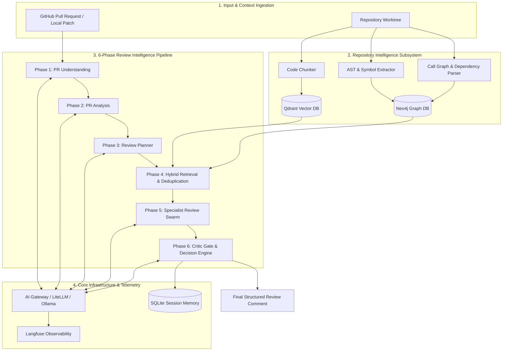
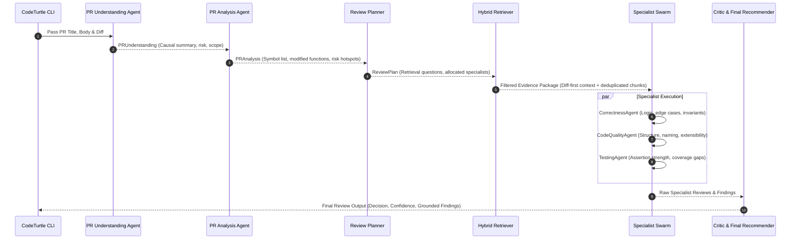

# CodeTurtle 

> **Autonomous, Local-First Multi-Agent Swarm for Repository-Aware GitHub Code Reviews**

[](https://www.python.org/downloads/)
[](https://github.com/langchain-ai/langgraph)
[](https://qdrant.tech/)
[](https://neo4j.com/)
[](https://ollama.ai/)
[](https://langfuse.com/)
[](LICENSE)

CodeTurtle is an **AI-native, repository-intelligent code review platform**. Unlike traditional LLM review tools that operate strictly on isolated diff snippets, CodeTurtle constructs a deep, structural understanding of your entire repository using hybrid vector-graph RAG, plans targeted evidence retrieval, and dispatches a multi-agent swarm to evaluate pull requests against real system invariants.

---

## 📸 Key Capabilities & Highlights

- 🧠 **Repository-Aware RAG**: Dual-store vector (`Qdrant`) + graph (`Neo4j`) indexing captures semantic embeddings, AST symbol definitions, import dependencies, and caller/callee graphs.
- 🎯 **Hypothesis-Driven Planning**: Dynamically formulates retrieval questions based on PR changes, allocating specialist agents based on risk profile and system invariants.
- 🔬 **Diff-First Context Packing**: Leads with the unified diff as primary ground truth, filtering secondary repository evidence to eliminate hallucinated repository tours.
- 🐝 **Multi-Agent Specialist Swarm**: Autonomous domain specialists (`CorrectnessAgent`, `CodeQualityAgent`, `TestingAgent`) bound by anti-summarization prompt contracts.
- 🛡️ **Critic & Reasoned Decision Engine**: Deduplicates findings, resolves specialist contradictions, and generates actionable, structured final review decisions (`MERGE`, `REQUEST_CHANGES`, `COMMENT`).
- ⚡ **Local-First & Production Gateway**: Multi-provider AI Gateway supporting Ollama (e.g. `qwen2.5:7b`), OpenAI, and LiteLLM with structured output parsing, automatic retries, and Langfuse telemetry.

---

## 🏛️ System Architecture

CodeTurtle separates concerns across **Repository Intelligence** (indexing & retrieval), **Review Intelligence** (planning & multi-agent swarm), and **Execution Infrastructure** (AI Gateway, session state, observability).


```mermaid
flowchart TD
    subgraph Input ["1. Input & Context Ingestion"]
        PR[GitHub Pull Request / Local Patch]
        Git[Repository Worktree]
    end

    subgraph RepoIntel ["2. Repository Intelligence Subsystem"]
        AST[AST & Symbol Extractor]
        GraphBuilder[Call Graph & Dependency Parser]
        Chunker[Code Chunker]
        Qdrant[(Qdrant Vector DB)]
        Neo4j[(Neo4j Graph DB)]
        
        Git --> AST & GraphBuilder & Chunker
        Chunker --> Qdrant
        AST & GraphBuilder --> Neo4j
    end

    subgraph Pipeline ["3. 6-Phase Review Intelligence Pipeline"]
        P1[Phase 1: PR Understanding]
        P2[Phase 2: PR Analysis]
        P3[Phase 3: Review Planner]
        P4[Phase 4: Hybrid Retrieval & Deduplication]
        P5[Phase 5: Specialist Review Swarm]
        P6[Phase 6: Critic Gate & Decision Engine]

        PR --> P1
        P1 --> P2
        P2 --> P3
        P3 --> P4
        Qdrant & Neo4j --> P4
        P4 --> P5
        P5 --> P6
    end

    subgraph Infrastructure ["4. Core Infrastructure & Telemetry"]
        Gateway[AI Gateway / LiteLLM / Ollama]
        Langfuse[Langfuse Observability]
        Memory[(SQLite Session Memory)]
    end

    P1 & P2 & P3 & P5 & P6 <--> Gateway
    Gateway --> Langfuse
    P6 --> Output[Final Structured Review Comment]
    P6 --> Memory
```

---

## 🔄 The 6-Phase Review Pipeline

CodeTurtle executes reviews via a deterministic, multi-stage LangGraph workflow:


```mermaid
sequenceDiagram
    autonumber
    participant CLI as CodeTurtle CLI
    participant P1 as PR Understanding Agent
    participant P2 as PR Analysis Agent
    participant P3 as Review Planner
    participant P4 as Hybrid Retriever
    participant P5 as Specialist Swarm
    participant P6 as Critic & Final Recommender

    CLI->>P1: Pass PR Title, Body & Diff
    P1-->>P2: PRUnderstanding (Causal summary, risk, scope)
    P2-->>P3: PRAnalysis (Symbol list, modified functions, risk hotspots)
    P3-->>P4: ReviewPlan (Retrieval questions, allocated specialists)
    P4-->>P5: Filtered Evidence Package (Diff-first context + deduplicated chunks)
    
    par Specialist Execution
        P5->>P5: CorrectnessAgent (Logic, edge cases, invariants)
        P5->>P5: CodeQualityAgent (Structure, naming, extensibility)
        P5->>P5: TestingAgent (Assertion strength, coverage gaps)
    end

    P5-->>P6: Raw Specialist Reviews & Findings
    P6-->>CLI: Final Review Output (Decision, Confidence, Grounded Findings)
```

### Phase Details

1. **Phase 1: PR Understanding (`pr_understanding.py`)**
   - Extracts causal intent (what broke → why → how fix addresses it), risk level (`low`, `medium`, `high`, `critical`), and out-of-scope boundaries from the PR title/description.
2. **Phase 2: PR Analysis (`pr_analysis.py`)**
   - Deterministically parses diff hunks to identify modified functions, added functions, constants, test changes, and language distributions. Scans diff context to recover enclosing symbols.
3. **Phase 3: Review Planning (`planner.py`)**
   - Formulates targeted retrieval questions and allocates specialist agents (`CORRECTNESS`, `CODE_QUALITY`, `TESTING`, `SECURITY`, `PERFORMANCE`, etc.) based on risk profile and file touch points.
4. **Phase 4: Hybrid Retrieval & Evidence Deduplication (`hybrid_retriever.py`)**
   - Combines vector search, metadata symbol lookup, path forcing, and graph neighbor expansion. Applies global deduplication (`merge_evidence_packages`) to prevent overlapping context walls.
5. **Phase 5: Specialist Swarm Execution (`agents.py`)**
   - Runs domain-specialist agents with **diff-first context packing** (unified diff leads prompt, evidence is secondary). Enforces anti-summarization prompt contracts and applies post-generation PR relevance filtering.
6. **Phase 6: Critic Gate & Decision Engine (`agents.py`)**
   - Filter out duplicate or ungrounded findings, resolves specialist contradictions, evaluates residual risks, and computes the final recommendation: `MERGE`, `REQUEST_CHANGES`, or `COMMENT`.

---

## 🔎 Repository Intelligence & Hybrid RAG

CodeTurtle avoids vector-only retrieval limitations by pairing semantic search with graph-based structural queries:

- **Vector Store (Qdrant)**: Stores code chunks with semantic metadata (file path, line ranges, symbols).
- **Graph Database (Neo4j)**: Maps files, classes, functions, and import edges (`CALLS`, `IMPORTS`, `DEFINES`, `OVERRIDES`).
- **Hybrid Retrieval Strategy**:
  1. **Path-Forcing**: Guarantees changed files in the diff are always present in the context.
  2. **Symbol Lookup**: Direct metadata matching on modified/added function and class names.
  3. **Graph Expansion**: Fetches 1-hop and 2-hop caller/callee neighborhoods for affected symbols.
  4. **Cross-Encoder Reranking**: Scores retrieved chunks against the plan's retrieval questions.
  5. **Global Deduplication**: Stable union of chunks across queries to maximize token efficiency.

---

## ⚡ AI Gateway & Telemetry

All LLM calls route through a unified, resilient **AI Gateway** (`core/gateway/gateway.py`):

- **Capability-Based Routing**: Maps agent roles (`reasoning`, `correctness_review`, `code_quality_review`, `summarization`) to specified models and providers.
- **Provider Support**: Seamlessly switches between local Ollama models (`qwen2.5:7b`, `llama3.1`, `deepseek-r1`), OpenAI (`gpt-4o`, `o3-mini`), or any LiteLLM-compatible endpoint.
- **Structured JSON Parsing**: Pydantic schema validation with automatic retry handling.
- **Langfuse Telemetry**: Tracks per-agent prompt/completion tokens, latency, retries, cost estimates, and full execution traces.

---

## 📂 Repository Structure

```
CodeTurtle/
├── cli/                        # Typer CLI application
│   ├── commands/               # CLI command modules
│   │   ├── add_repo.py         # Index repository into KnowledgeBase
│   │   ├── init.py             # Initialize configuration & environment
│   │   ├── inspect_kb.py       # Inspect vector & graph stores
│   │   ├── review.py           # Execute PR review pipeline
│   │   └── session.py          # Manage review history & memory
│   └── main.py                 # CLI entry point (`codeturrtle`)
│
├── core/                       # Core engine logic
│   ├── gateway/                # AI Gateway & provider integrations
│   │   ├── gateway.py          # AIGateway routing & telemetry
│   │   └── providers.py        # Ollama, OpenAI, LiteLLM adapters
│   │
│   ├── repository_intelligence/ # Codebase parsing & graph indexing
│   │   ├── graph/              # Neo4j query builders & import resolvers
│   │   ├── parsers/            # Language AST parsers
│   │   └── pipeline.py         # Repository indexing pipeline
│   │
│   ├── review_intelligence/    # Planner & evidence utilities
│   │   ├── evidence_util.py    # Evidence normalization
│   │   ├── models.py           # ReviewPlan & RetrievalQuestion schemas
│   │   └── planner.py          # Phase 3 Review Planner
│   │
│   ├── agents.py               # Phase 5 Specialists & Phase 6 Critic/Recommender
│   ├── chunker.py              # Code chunking algorithms
│   ├── hybrid_retriever.py     # Phase 4 Hybrid retriever & deduplicator
│   ├── knowledge_base.py       # Qdrant & SQLite KnowledgeBase manager
│   ├── models.py               # Domain schemas (PRUnderstanding, SpecialistReview, etc.)
│   ├── pr_analysis.py          # Phase 2 PR Analysis Agent
│   ├── pr_understanding.py     # Phase 1 PR Understanding Agent
│   ├── state.py                # LangGraph ReviewState schema
│   └── reranker.py             # Cross-encoder & structural reranker
│
├── evals/                      # Quantitative evaluation framework
│   └── ri/                     # Phase-by-phase review intelligence evals
│       ├── phase1_understanding.py
│       ├── phase2_analysis.py
│       ├── phase3_planner.py
│       ├── phase4_retrieval.py
│       ├── phase5_specialists.py
│       ├── phase6_critic_final.py
│       └── run_all.py          # Master evaluation suite runner
│
├── config.py                   # Environment & Pydantic settings
├── pyproject.toml              # Dependencies & build configuration
└── README.md
```

---

## 🚀 Quick Start Guide

### Prerequisites

- **Python**: `^3.10`
- **Package Manager**: [`uv`](https://github.com/astral-sh/uv) (recommended) or `pip`
- **Local LLM Runner**: [Ollama](https://ollama.ai/) installed and running (if using local models)
- **Optional Databases**: [Qdrant](https://qdrant.tech/) and [Neo4j](https://neo4j.com/) (defaults to embedded/in-memory modes)

### 1. Installation

Clone the repository and install dependencies:

```bash
git clone https://github.com/venkatpachala/CodeTurtle.git
cd CodeTurtle

# Using uv (recommended)
uv venv
source .venv/bin/activate  # On Windows: .venv\Scripts\activate
uv sync

# Or using standard pip
pip install -e .
```

### 2. Environment Configuration

Create a `.env` file in the project root:

```ini
# GitHub Access Token (for fetching public/private PRs)
GITHUB_TOKEN=github_pat_your_token_here

# LLM Gateway Configuration
LLM_BACKEND=ollama
OLLAMA_MODEL=qwen2.5:7b
OLLAMA_BASE_URL=http://localhost:11434

# Optional: OpenAI (if using OpenAI models)
OPENAI_API_KEY=sk-proj-your-key-here

# Optional: Langfuse Telemetry
LANGFUSE_PUBLIC_KEY=pk-lf-...
LANGFUSE_SECRET_KEY=sk-lf-...
LANGFUSE_HOST=https://cloud.langfuse.com

# Optional: Neo4j Graph Database
NEO4J_URI=bolt://127.0.0.1:7687
NEO4J_USER=neo4j
NEO4J_PASSWORD=codeturtle123
```

Ensure your Ollama instance has the target model pulled:

```bash
ollama pull qwen2.5:7b
```

---

## 💻 CLI Command Reference

CodeTurtle provides a CLI via `codeturrtle`:

### Index a Repository

Index a local codebase into vector and graph stores before running reviews:

```bash
codeturrtle add-repo /path/to/your/repository
```

### Run a Pull Request Review

Run a full 6-phase autonomous review on a GitHub PR or local patch:

```bash
# Review a GitHub PR
codeturrtle review owner/repo 2400

# Review with custom model override
codeturrtle review owner/repo 2400 --model qwen2.5:7b
```

### Inspect Knowledge Base

Query indexed code chunks and structural graph relationships:

```bash
codeturrtle inspect-kb owner_repo --query "build_from_json"
```

### Manage Review Sessions & Memory

Inspect past review sessions and stored findings:

```bash
# List review sessions
codeturrtle session list

# View session history
codeturrtle session show <session-id>
```

---

## 🧪 Benchmark & Evaluation Suite

CodeTurtle includes an automated benchmark suite (`evals/ri/`) that tests all 6 pipeline phases against real-world PRs:

```bash
# Run the complete end-to-end evaluation suite
python evals/ri/run_all.py Graphify-Labs/graphify 2400

# Run specific phase evaluations
python evals/ri/phase1_understanding.py Graphify-Labs/graphify 2400
python evals/ri/phase2_analysis.py Graphify-Labs/graphify 2400
python evals/ri/phase3_planner.py Graphify-Labs/graphify 2400
python evals/ri/phase4_retrieval.py Graphify-Labs/graphify 2400
python evals/ri/phase5_specialists.py Graphify-Labs/graphify 2400
python evals/ri/phase6_critic_final.py Graphify-Labs/graphify 2400
```

---

## 🤝 Contributing

Contributions are welcome! Please follow these guidelines:

1. Fork the repository and create a feature branch (`git checkout -b feature/amazing-feature`).
2. Ensure all 6 evaluation phases pass (`python evals/ri/run_all.py Graphify-Labs/graphify 2400`).
3. Commit your changes with clear, descriptive messages.
4. Open a Pull Request detailing your changes and verification results.

---