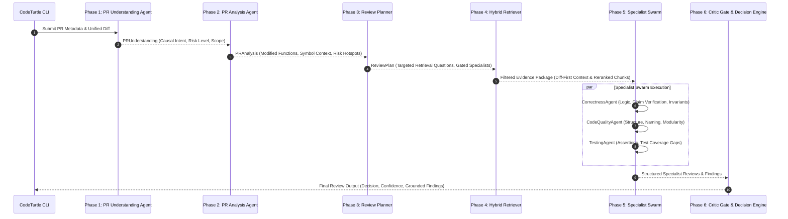

# CodeTurtle

CodeTurtle is a **local-first agentic GitHub PR reviewer**. It fetches a pull request with your token, builds Graphify structural context for the repo, runs a clamped specialist swarm, and prints **MERGE**, **COMMENT**, or **REQUEST_CHANGES**. It is a Hermes-style CLI: it runs on your machine, with your model, and does not post unless you ask it to.

---

## Install

```bash
# From git (recommended)
uv tool install git+https://github.com/venkatpachala/CodeTurtle.git

# Or from a clone
git clone https://github.com/venkatpachala/CodeTurtle.git
cd CodeTurtle
pip install -e .
# Windows: activate the venv so `codeturtle` is on PATH
#   .venv\Scripts\activate
```

To actually run a review you also need an LLM backend and Graphify:

```bash
pip install -e ".[ollama,graphify]"
```

Confirm the console script:

```bash
codeturtle --help
codeturtle review --help
```

You should see `review`, `add-repo`, `new-session`, and `graphify-test`. You do **not** need `python -m cli.main`.

---

## Setup

1. Copy `.env.example` to `.env` and set `GITHUB_TOKEN` (a classic token with `public_repo`, or `gh auth token`).
2. Pull a local model (default backend is Ollama):

```bash
ollama pull qwen2.5:7b
```

3. Build a Graphify **code-only** graph for the repository you will review:

```bash
git clone https://github.com/owner/repo repos/owner_repo
cd repos/owner_repo
graphify . --code-only
```

Qdrant and Neo4j are **not** required for `codeturtle --help` or `codeturtle review --dry-run`. First-time path is: GitHub token + LLM + Graphify code-only graph.

---

## Commands

```bash
codeturtle new-session
codeturtle review owner/repo PR --dry-run
codeturtle review owner/repo PR --comment
codeturtle graphify-test owner/repo --stats
```

Also available: `codeturtle add-repo`, `codeturtle inspect-kb`, `codeturtle list-sessions`.

---

## Defaults

- **`--dry-run` is the default.** Nothing is posted to GitHub (and nothing is written to FalkorDB) unless you pass `--comment` or `--no-dry-run`.
- Lockfile-only PRs → `COMMENT`, investigation skipped.
- Green tests do **not** auto-MERGE.

---

## Optional

- Per-repo policy: copy `examples/codeturtle.yaml` to `.codeturtle.yaml` (`docs/codeturtle-yaml.md`).
- GitHub Action: `examples/github-action.yml` (`docs/github-action.md`).
- Extras: `ollama`, `openai`, `graphify`, `langfuse`, `qdrant`, `neo4j`.

---

## Dev eval

Golden-gate eval (classification, investigate skip, KEEP paths, hunk stamp, final clamp). This is **not** the first-time path:

```bash
uv run python -m tests.evaluation.run_eval --offline
```

Live (optional, needs GitHub + Ollama): `uv run python -m tests.evaluation.run_eval --live --ids qw-538,qw-571`. Default live does **not** pass `--execute-install`.

---

## System Architecture

The following diagram illustrates CodeTurtle's end-to-end architecture across CLI commands, codebase ingestion, repository intelligence & Graphify MCP adapter, query engine, 6-phase review swarm, and AI gateway infrastructure:


```mermaid
flowchart TB
    subgraph CLI ["CLI Layer (cli/)"]
        direction LR
        CmdReview["codeturtle review"]
        CmdAddRepo["codeturtle add-repo"]
        CmdInspect["codeturtle inspect-kb"]
        CmdGraphify["codeturtle graphify-test"]
        CmdSession["codeturtle session"]
    end

    subgraph Ingestion ["1. Context & Codebase Ingestion"]
        direction LR
        GitHubAPI["GitHub API / Unified Diff"]
        LocalRepo["Local Git Worktree"]
    end

    subgraph KnowledgeLayer ["2. Repository Intelligence & Structural Knowledge"]
        direction TB
        ASTParser["AST Language Parsers<br/>(Python, TS, JS, Go, Java)"]
        GraphBuilder["Call Graph & Import Resolver<br/>(import_resolver.py)"]
        Chunker["Code Chunker<br/>(chunker.py)"]
        
        subgraph GraphifyMCP ["Graphify MCP Integration (core/repository_knowledge/)"]
            MCPAdapter["GraphifyMCPProvider<br/>(MCP stdio Adapter)"]
            GraphifyEngine["Graphify Knowledge Graph DB"]
            MCPAdapter <--> GraphifyEngine
        end

        subgraph Databases ["Dual-Store Index Layer (optional)"]
            Qdrant[("Qdrant Vector Database<br/>(Semantic Embeddings)")]
            Neo4j[("Neo4j Graph Database<br/>(AST Symbols & Call Graphs)")]
        end

        LocalRepo --> ASTParser & GraphBuilder & Chunker & GraphifyEngine
        Chunker --> Qdrant
        ASTParser & GraphBuilder --> Neo4j
    end

    subgraph QuerySubsystem ["3. Query Engine Subsystem (core/query_engine/)"]
        VectorRouter["VectorRouter (Qdrant)"]
        GraphRouter["GraphRouter (Neo4j)"]
        ModelRouter["ModelRouter (Capabilities)"]
        QueryEngine["QueryEngine<br/>(Retrieval & Impact Analysis)"]
        
        VectorRouter & GraphRouter & ModelRouter --> QueryEngine
    end

    subgraph Pipeline ["4. 6-Phase Review Intelligence Swarm (LangGraph)"]
        direction TB
        
        P1["Phase 1: PR Understanding Agent<br/>(pr_understanding.py)"]
        P2["Phase 2: PR Analysis Agent<br/>(pr_analysis.py)"]
        P3["Phase 3: Review Planner Agent<br/>(planner.py)"]
        
        subgraph P4Sub ["Phase 4: Hybrid Retrieval Engine (hybrid_retriever.py)"]
            PathForce["Path-Forced Hunks"]
            SymbolSearch["Metadata Symbol Search"]
            VectorSearch["Vector Similarity Search"]
            GraphExp["Graph Neighborhood Expansion"]
            Reranker["Cross-Encoder Reranker"]
            GlobalDedupe["Global Evidence Deduplicator"]

            PathForce & SymbolSearch & VectorSearch & GraphExp --> Reranker --> GlobalDedupe
        end

        subgraph P5Sub ["Phase 5: Specialist Review Swarm (agents.py)"]
            Correctness["Correctness Agent<br/>(Claim Verification & Logic)"]
            CodeQuality["Code Quality Agent<br/>(Structure & Extensibility)"]
            Testing["Testing Agent<br/>(Assertions & Coverage Gaps)"]
            OptionalAgents["Optional Domain Specialists"]
        end

        subgraph P6Sub ["Phase 6: Critic Gate & Decision Engine (agents.py)"]
            GroundingFilter["Evidence Grounding Filter"]
            RelevanceFilter["PR Relevance Filter"]
            CriticGate["Critic Agent<br/>(Claim Challenge & Deduplication)"]
            FinalRecommender["Final Recommender<br/>(Decision: MERGE / REQUEST_CHANGES / COMMENT)"]

            GroundingFilter --> RelevanceFilter --> CriticGate --> FinalRecommender
        end

        P1 --> P2 --> P3 --> P4Sub --> P5Sub --> P6Sub
    end

    subgraph Infra ["5. AI Gateway & Telemetry (core/gateway/)"]
        direction TB
        Gateway["AI Gateway (gateway.py)<br/>(Capability Routing & Schema Retries)"]
        
        subgraph LLMProviders ["LLM Provider Adapters"]
            Ollama["Ollama (qwen2.5-coder:7b, llama3)"]
            OpenAI["OpenAI (gpt-4o, o3-mini)"]
            LiteLLM["LiteLLM Unified Adapter"]
        end

        Langfuse["Langfuse Observability<br/>(Traces, Tokens, Latency, Cost)"]
        Memory[("SQLite Session Memory<br/>(Review History & State)")]

        Gateway --> Ollama & OpenAI & LiteLLM
        Gateway --> Langfuse
    end

    GitHubAPI --> P1
    CmdAddRepo --> LocalRepo
    CmdReview --> GitHubAPI
    CmdGraphify --> MCPAdapter
    
    Qdrant --> VectorSearch
    Neo4j --> GraphExp
    QueryEngine --> P4Sub
    
    P1 <--> Gateway
    P2 <--> Gateway
    P3 <--> Gateway
    P5Sub <--> Gateway
    P6Sub <--> Gateway

    FinalRecommender --> ReviewOutput["Final Structured Review Comment"]
    FinalRecommender --> Memory
```

---

## The 6-Phase Review Pipeline

CodeTurtle executes PR reviews via a deterministic, multi-stage LangGraph workflow:


```mermaid
sequenceDiagram
    autonumber
    participant CLI as CodeTurtle CLI
    participant P1 as Phase 1: PR Understanding Agent
    participant P2 as Phase 2: PR Analysis Agent
    participant P3 as Phase 3: Review Planner
    participant P4 as Phase 4: Hybrid Retriever
    participant P5 as Phase 5: Specialist Swarm
    participant P6 as Phase 6: Critic Gate & Decision Engine

    CLI->>P1: Submit PR Metadata & Unified Diff
    P1-->>P2: PRUnderstanding (Causal Intent, Risk Level, Scope)
    P2-->>P3: PRAnalysis (Modified Functions, Symbol Context, Risk Hotspots)
    P3-->>P4: ReviewPlan (Targeted Retrieval Questions, Gated Specialists)
    P4-->>P5: Filtered Evidence Package (Diff-First Context & Reranked Chunks)

    par Specialist Swarm Execution
        P5->>P5: CorrectnessAgent (Logic, Claim Verification, Invariants)
        P5->>P5: CodeQualityAgent (Structure, Naming, Modularity)
        P5->>P5: TestingAgent (Assertions, Test Coverage Gaps)
    end

    P5-->>P6: Structured Specialist Reviews & Findings
    P6-->>CLI: Final Review Output (Decision, Confidence, Grounded Findings)
```

### Phase Details

1. **Phase 1: PR Understanding (`pr_understanding.py`)**
   - Extracts causal intent (what broke → why → how the fix addresses it), risk level (`low`, `medium`, `high`, `critical`), and explicit out-of-scope boundaries from the PR title and description.
2. **Phase 2: PR Analysis (`pr_analysis.py`)**
   - Deterministically parses diff hunks to identify modified functions, added functions, constants, test changes, and modified files. Scans surrounding context to recover enclosing symbols.
3. **Phase 3: Review Planning (`planner.py`)**
   - Formulates targeted retrieval questions and allocates plan-gated specialist agents (`CORRECTNESS`, `CODE_QUALITY`, `TESTING`, `SECURITY`, `PERFORMANCE`, etc.) based on risk hotspots and file touch points.
4. **Phase 4: Hybrid Retrieval & Evidence Deduplication (`hybrid_retriever.py`)**
   - Combines path-forced diff hunks, metadata symbol lookup, vector similarity search, and graph neighbor expansion. Uses cross-encoder structural reranking (`reranker.py`) and global deduplication (`merge_evidence_packages`). Live review retrieval is Graphify-first; Qdrant is optional.
5. **Phase 5: Specialist Swarm Execution (`agents.py`)**
   - Dispatches plan-gated domain specialists with **diff-first context packing** (unified diff leads prompt, evidence is secondary). Specialists actively challenge PR claims under anti-summarization prompt contracts.
6. **Phase 6: Critic Gate & Decision Engine (`agents.py`)**
   - Applies evidence grounding and relevance filters, deduplicates overlapping findings, resolves specialist contradictions, and computes the final recommendation: `MERGE`, `REQUEST_CHANGES`, or `COMMENT`.

---

## Graphify MCP & Repository Knowledge Layer

CodeTurtle introduces an extensible structural knowledge abstraction boundary (`core/repository_knowledge/`):

- **`RepositoryKnowledgeProvider`**: Abstract interface decoupling code review agents from underlying graph engines.
- **`GraphifyMCPProvider`**: Model Context Protocol (MCP) adapter connecting directly to Graphify knowledge graphs via stdio transport (`mcp` SDK).
- **Exposed MCP Tools**:
  - `query_graph`: Natural language graph queries over code relations.
  - `get_node`: Direct symbol/file node inspection.
  - `get_neighbors`: 1-hop caller/callee and import neighborhood retrieval.
  - `shortest_path`: Dependency and call-chain pathfinding between two code symbols.
  - `graph_stats`: Summary metrics of repository graph nodes and edges.

---

## Query Engine Subsystem

CodeTurtle features a decoupled **Query Engine** (`core/query_engine/`) for structured codebase exploration:

- **`VectorRouter`**: Semantic similarity search against Qdrant collection embeddings (optional extra).
- **`GraphRouter`**: Cypher structural queries against Neo4j AST and import graph edges (optional extra).
- **`ModelRouter`**: Capability-based LLM routing for context synthesis.
- **`QueryEngine`**: Orchestrates multi-router query execution, supporting `retrieve_context` and automated `impact_analysis`.

---

## AI Gateway & Telemetry

All LLM requests route through a unified **AI Gateway** (`core/gateway/gateway.py`):

- **Capability-Based Routing**: Maps agent roles (`reasoning`, `correctness_review`, `code_quality_review`, `summarization`) to configured model providers.
- **Provider Support**: Local Ollama (`qwen2.5-coder:7b`, `llama3`) or OpenAI (`gpt-4o`, `o3-mini`) via optional extras.
- **Structured JSON Retries**: Pydantic schema enforcement with automatic retry handling.
- **Langfuse Telemetry**: Optional extra. Tracks per-agent prompt/completion tokens, latency, retries, cost estimates, and full execution traces.

---

## Repository Structure

```
CodeTurtle/
├── cli/                        # Typer CLI application
│   ├── commands/               # CLI command modules
│   │   ├── add_repo.py         # Index repository into KnowledgeBase
│   │   ├── graphify_cmd.py     # Graphify MCP integration CLI (`graphify-test`)
│   │   ├── init.py             # Initialize configuration & environment
│   │   ├── inspect_kb.py       # Inspect vector & graph stores
│   │   ├── review.py           # Execute 6-phase review pipeline
│   │   └── session.py          # Manage review sessions & memory
│   └── main.py                 # CLI entry point (`codeturtle`)
│
├── core/                       # Core engine & agent logic
├── tests/evaluation/           # Golden-gate eval (offline fixtures)
├── config.py                   # Environment & Pydantic settings
├── pyproject.toml              # Package metadata and console script
└── README.md
```

---

## Contributing

Contributions are welcome! Please follow these steps:

1. Fork the repository and create a feature branch (`git checkout -b feature/amazing-feature`).
2. Run the golden-gate eval: `uv run python -m tests.evaluation.run_eval --offline`.
3. Commit your changes with clear, descriptive commit messages.
4. Open a Pull Request with a breakdown of your changes and test results.
