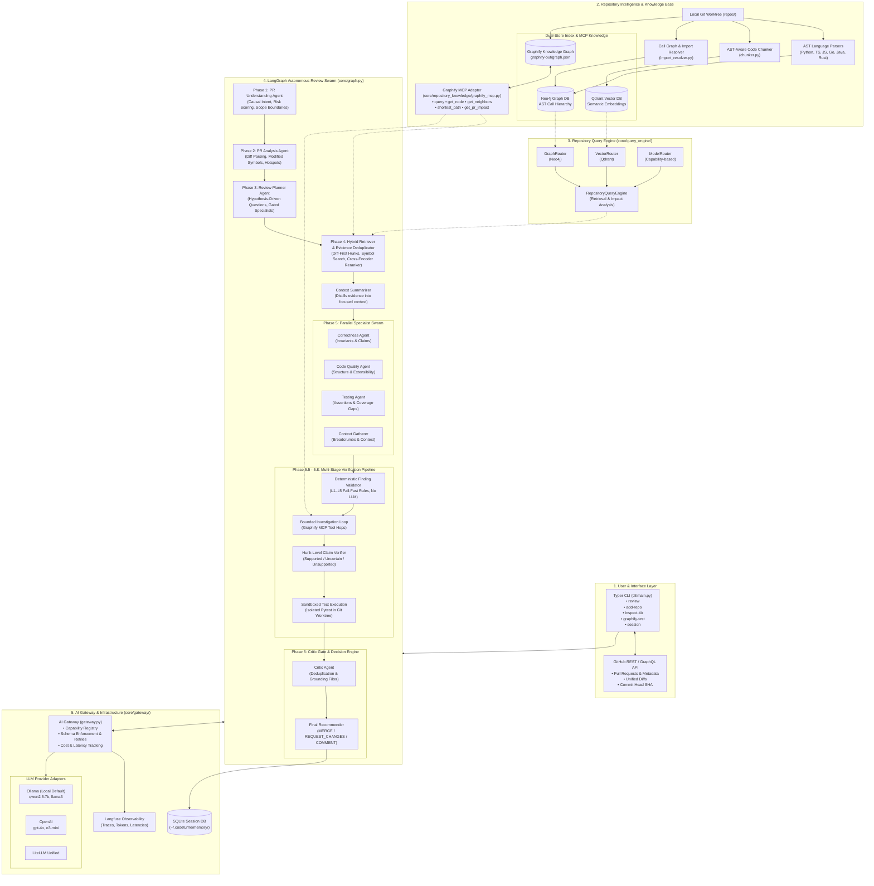
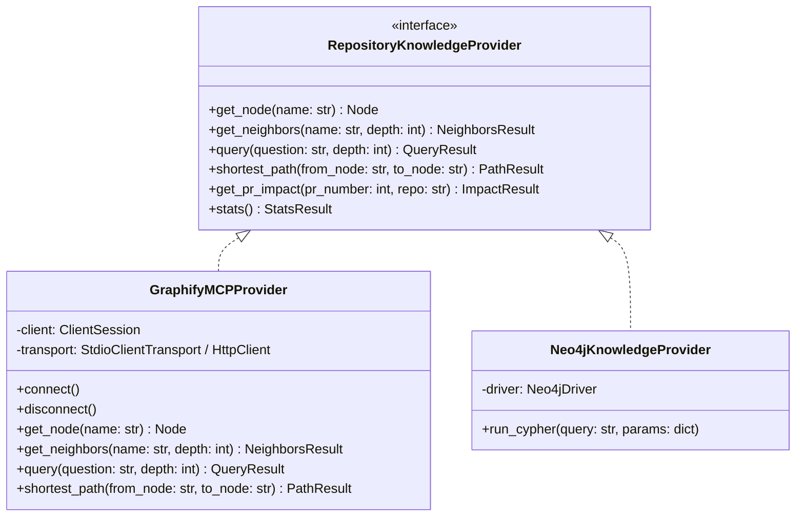
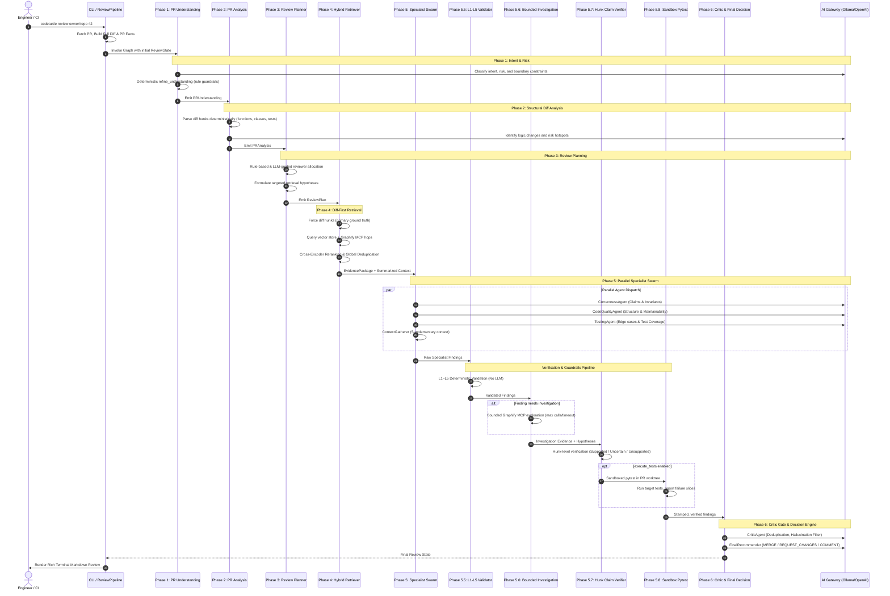
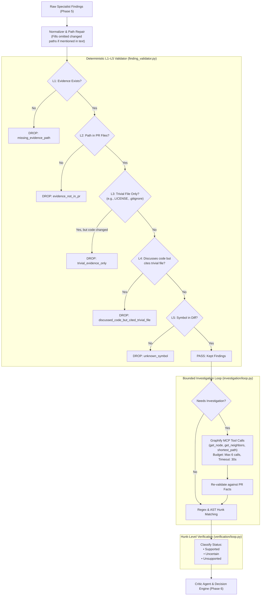
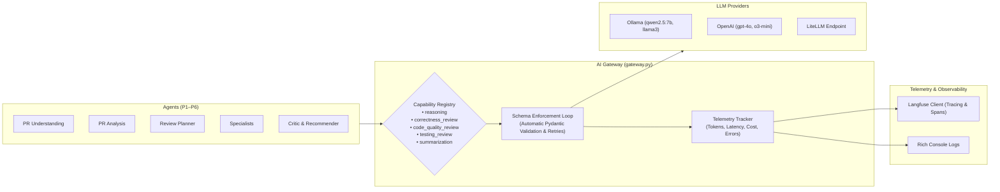

# CodeTurtle System Design Document

CodeTurtle is an **autonomous, local-first multi-agent swarm for repository-aware GitHub code reviews**. Unlike traditional LLM-based code review tools that operate on isolated diff snippets without project context, CodeTurtle indexes and traverses whole-codebase structures (AST symbols, call graphs, import dependencies, and semantic embeddings) using a hybrid vector-graph retrieval architecture, Graphify Model Context Protocol (MCP) integration, and a deterministic 6-phase LangGraph agent pipeline with multi-layer verification gates.

---

## 1. High-Level System Architecture



---

## 2. Core Subsystems & Components

### 2.1 Interface & CLI Layer (`cli/`)
Built with **Typer** and styled with **Rich**:
- **`codeturtle review <owner/repo> <pr_number>`**: Orchestrates repository checkout, diff extraction, knowledge retrieval, and invokes the LangGraph swarm.
- **`codeturtle add-repo <path>`**: Triggers AST-aware chunking and builds dual-store indexes (Qdrant vectors + Neo4j/Graphify graphs).
- **`codeturtle graphify-test <owner/repo>`**: Interactively queries the Graphify knowledge base via Model Context Protocol (`--stats`, `--query`, `--node`, `--from/--to`).
- **`codeturtle inspect-kb <repo>`**: Queries vector embeddings and symbol relationships.
- **`codeturtle session`**: Manages SQLite review sessions and multi-turn state.

---

### 2.2 Dual-Store Knowledge & Graphify MCP Integration (`core/repository_knowledge/` & `core/repository_intelligence/`)
CodeTurtle enforces an abstraction boundary separating code review agents from underlying graph engines through `RepositoryKnowledgeProvider`.



1. **Vector Store (Qdrant)**:
   - Stores code chunks created by `chunker.py`.
   - Chunks preserve structural metadata (`path`, `symbols`, `start_line`, `end_line`, `chunk_type`).
2. **Knowledge Graph (Neo4j / Graphify)**:
   - Preserves AST hierarchies, class inheritance, function calls (`CALLS`), and module dependencies (`IMPORTS`).
3. **Graphify MCP Protocol Bridge**:
   - Spawns a dedicated MCP server via stdio or connects via HTTP (`http://localhost:8080/mcp`).
   - Translates high-level agent queries into graph traversals to uncover non-local architectural side effects.

---

### 2.3 The 6-Phase Review Intelligence Swarm (`LangGraph`)

The core execution engine is a compiled LangGraph `StateGraph` operating over a shared `ReviewState` structure.



---

## 3. Detailed Phase Specifications

| Phase | Module | Primary Purpose | Key Algorithms / Guardrails |
| :--- | :--- | :--- | :--- |
| **Phase 1: PR Understanding** | `pr_understanding.py` | Extracts causal intent, risk tier, and scope boundaries. | `refine_understanding`: Core path bugfixes automatically bumped to medium risk; filters banned subjective risk phrases. |
| **Phase 2: PR Analysis** | `pr_analysis.py` | AST/hunk parsing of changed symbols, modified classes, lines, and tests. | Deterministic diff hunk parser (`analyze_diff`), symbol context recovery, hotspot detection. |
| **Phase 3: Review Planning** | `review_intelligence/planner.py` | Hypothesis-driven query generation and specialist reviewer gating. | Dynamic reviewer allocation: `CORRECTNESS` (always), `TESTING` (if code/test changed), `CODE_QUALITY` (if risk $\ge$ medium or $>3$ files). Formulates targeted questions. |
| **Phase 4: Hybrid Retrieval** | `hybrid_retriever.py` | Combines path-forced diff hunks with vector similarity and graph neighbors. | **Diff-First Context Packing**: Unified diff leads context; cross-encoder reranker (`reranker.py`); `merge_evidence_packages` global deduplicator. |
| **Phase 5: Specialist Swarm** | `agents.py` | Parallel specialist reviewers challenging claims under anti-summarization contracts. | Explicit Pydantic schemas (`SpecialistReview`); forced concrete claims (`SpecialistFinding.claim`); positive confirmation (`verified`). |
| **Phase 5.5: Finding Validator** | `finding_validator.py` | Deterministic verification of finding grounding (Zero LLM reliance). | **L1–L5 Validation Gates**: Checks evidence existence, PR path membership, trivial file exclusion, code-vs-trivia mismatch, and diff symbol validation. |
| **Phase 5.6: Bounded Investigation** | `investigation/loop.py` | Explores graph neighborhoods for uncertain claims. | Bounded Graphify MCP calls (`get_node`, `get_neighbors`, `query`, `shortest_path`), hypothesis tracking, strict timeout guardrails. |
| **Phase 5.7: Claim Verification** | `verification/loop.py`, `hunk_verifier.py` | Cross-checks claims directly against unified diff hunks. | Stamps findings with status: `supported`, `uncertain`, `unsupported`. Suggests policy-based review recommendation. |
| **Phase 5.8: Sandboxed Execution** | `verification/execute.py` | Optional active test verification. | Path-jailed worktree runner, no `shell=True`, timeout enforcement, lockfile PR skip logic, isolated venv/uv sync. |
| **Phase 6: Critic & Recommendation** | `agents.py` | Final review synthesis, contradiction resolution, and decision issuing. | `CriticAgent` removes redundant claims and cross-contradictions; `FinalRecommender` computes confidence and outputs structured markdown comment. |

---

## 4. Multi-Layer Guardrail & Anti-Hallucination Pipeline

A cornerstone of CodeTurtle's architecture is its **defense-in-depth against LLM hallucination and shallow summarization**:



---

## 5. AI Gateway & Provider Abstraction (`core/gateway/`)

All LLM calls within CodeTurtle route through a centralized `AIGateway`:



- **Capability Mapping**: Decouples prompt requirements from concrete models (e.g. `correctness_review` $\rightarrow$ `ollama / qwen2.5:7b`).
- **Pydantic Structured Output**: Enforces valid JSON according to strongly typed schemas; re-prompts on parsing errors up to configurable retry limits.
- **Full Observability**: Logs prompt tokens, completion tokens, latency, retry counts, and estimated cost per agent execution into **Langfuse**.

---

## 6. Persistence & State Data Structures

### 6.1 Unified Review State (`core/state.py`)
```python
class ReviewState(TypedDict):
    repo: str
    number: int
    title: str
    body: str
    author: str
    full_diff: str
    files_changed: List[str]
    pr_facts: NotRequired[dict]
    
    # Review Intelligence
    pr_understanding: Optional[dict]
    pr_analysis: Optional[PRAnalysis]
    review_plan: Optional[dict]
    evidence_package: Optional[Dict]
    summarized_context: str

    # Findings
    correctness_findings: List[Finding]
    quality_findings: List[Finding]
    testing_findings: List[Finding]
    validated_findings: List[Finding]
    findings: List[Finding]

    # Verification & Reports
    hypotheses: NotRequired[list]
    investigation_evidence: NotRequired[list]
    investigation_report: NotRequired[dict]
    verification_report: NotRequired[dict]
    execution_report: NotRequired[dict]

    # Decisions & Metadata
    critique: Dict
    final_comment: Dict
    recommendation: Literal["MERGE", "REQUEST_CHANGES", "COMMENT"]
    traces: Annotated[List[dict], operator.add]
```

### 6.2 SQLite Session Memory (`core/memory/`)
Stored under `~/.codeturrle/memory/memory.db`:
- **`sessions` table**: Tracks active session UUIDs, repository context, and target pull requests.
- **`reviews` table**: Persists historical review outputs, findings, recommendations, confidence scores, and raw state for multi-turn conversational queries.

---

## 7. Technology Stack Summary

| Layer | Component / Technology | Justification / Role |
| :--- | :--- | :--- |
| **CLI & UI** | Typer, Rich | Ergonomic command-line flags, interactive terminals, and markdown tables. |
| **Agent Orchestration** | LangGraph, LangChain | Deterministic graph state transitions, parallel fan-out / fan-in execution. |
| **Protocol Integration** | Model Context Protocol (MCP stdio/HTTP) | Decoupled client-server graph queries against Graphify knowledge graphs. |
| **Vector Database** | Qdrant (`qdrant-client`, `langchain-qdrant`) | High-performance embedding similarity search with rich metadata filtering. |
| **Graph Database** | Neo4j (`neo4j`), Graphify | Deep AST symbol and import dependency traversal, shortest paths, neighborhood analysis. |
| **LLM Gateway** | Ollama, OpenAI SDK, LiteLLM | Local-first inference with zero cloud dependency; cloud fallbacks on demand. |
| **Observability** | Langfuse, Structlog | Per-agent token tracking, distributed trace visualization, latency analysis. |
| **Evaluation Suite** | Python benchmark harnesses (`evals/ri/`) | Phase-by-phase quantitative benchmarking on real-world pull requests. |
